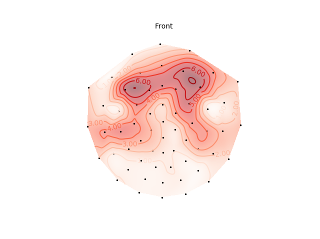

## Topomap
Implementation of Scalp Topography Map Using Python

- Sample data : https://gist.githubusercontent.com/anonymous/d8975f76f5bcde7bd455/raw/831239b213fc29462db68f33caad3f05c57c0eff/topoplot_sample_data.csv
- Output:  

